# QA

| 항목 | 내용 |
| --- | --- |
| 작성일 | 2026-05-11 |
| 작성자 | 박재윤 |

---

## 📋 전체 목록

| ID | 화면 | 피드백 |
| --- | --- | --- |
| [F-01](#f-01--상단-nav바-높이-조정) | 공통 | 상단 nav바 높이 조정 |
| [F-02](#f-02--로그인-화면-3건-라이트-모드) | 로그인 | 로고 수정 + 카카오·애플 버튼 색상 |
| [F-03](#f-03--이용약관-마크다운-렌더링) | 로그인 | 이용약관 마크다운 렌더링 |
| [F-04](#f-04--홈-메인-여백사이즈-조정) | 홈 메인 | 여백·사이즈 조정 |
| [F-05](#f-05--실시간-기록--그래프-배경--감정-뱃지-색상) | 홈 > 실시간 기록 | 원형 그래프 배경 + 감정 뱃지 색상 |
| [F-06](#f-06--실시간-기록--숫자-단위--표시--카메라-버튼-3건) | 홈 > 실시간 기록 | 숫자 단위·표시·카메라 버튼 3건 |
| [F-07](#f-07--경기-일정--ui-5건) | 홈 > 경기 일정 | 배경색·날짜 정렬·밑줄·시간 형식·문구 5건 |
| [F-08](#f-08--kbo-순위--바텀시트-높이--감정-뱃지-색상) | 커뮤니티 > KBO 순위 | 바텀시트 높이 + 감정 뱃지 색상 |
| [F-09](#f-09--친구-추가--키보드-미표시) | 커뮤니티 > 친구 추가 | 친구 추가 시 키보드 미표시 |
| [F-10](#f-10--친구-추가하기-버튼-클릭-시-무반응) | 커뮤니티 > 친구 추가 | '친구 추가하기' 버튼 무반응 |
| [F-11](#f-11--친구-기록-페이지-접근-비활성화) | 커뮤니티 > 친구 기록 | 페이지 접근 비활성화 |
| [F-12](#f-12--마이페이지--nav바--문의하기-2건) | 마이페이지 | nav바 뒤로가기 + 문의하기 추가 |

---

## ✅ 공통

### F-01 · 상단 nav바 높이 조정

| | 내용 |
| --- | --- |
| **AS IS** | nav바 높이가 피그마 디자인보다 낮게 구현됨 |
| **TO BE** | 피그마 디자인 기준 높이에 맞게 조정 |

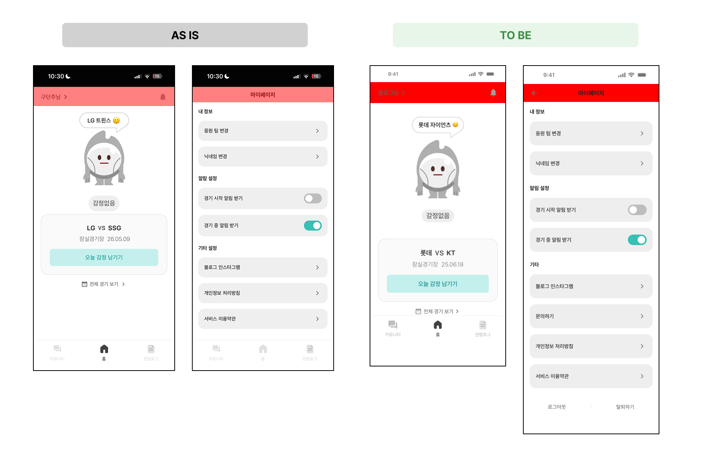

---

## ✅ 로그인/회원가입

### F-02 · 로그인 화면 3건 (라이트 모드)

| 항목 | AS IS | TO BE |
| --- | --- | --- |
| 로고 | 색상·크기 불일치 | 초록색 로고, 피그마와 동일한 크기 |
| 카카오 버튼 텍스트 | 다크모드 기준 색상 | `#212121` (검정) |
| 애플 버튼 | 다크모드 기준 색상 | 버튼 배경 `#212121`, 로고·텍스트 `#FFFFFF` |

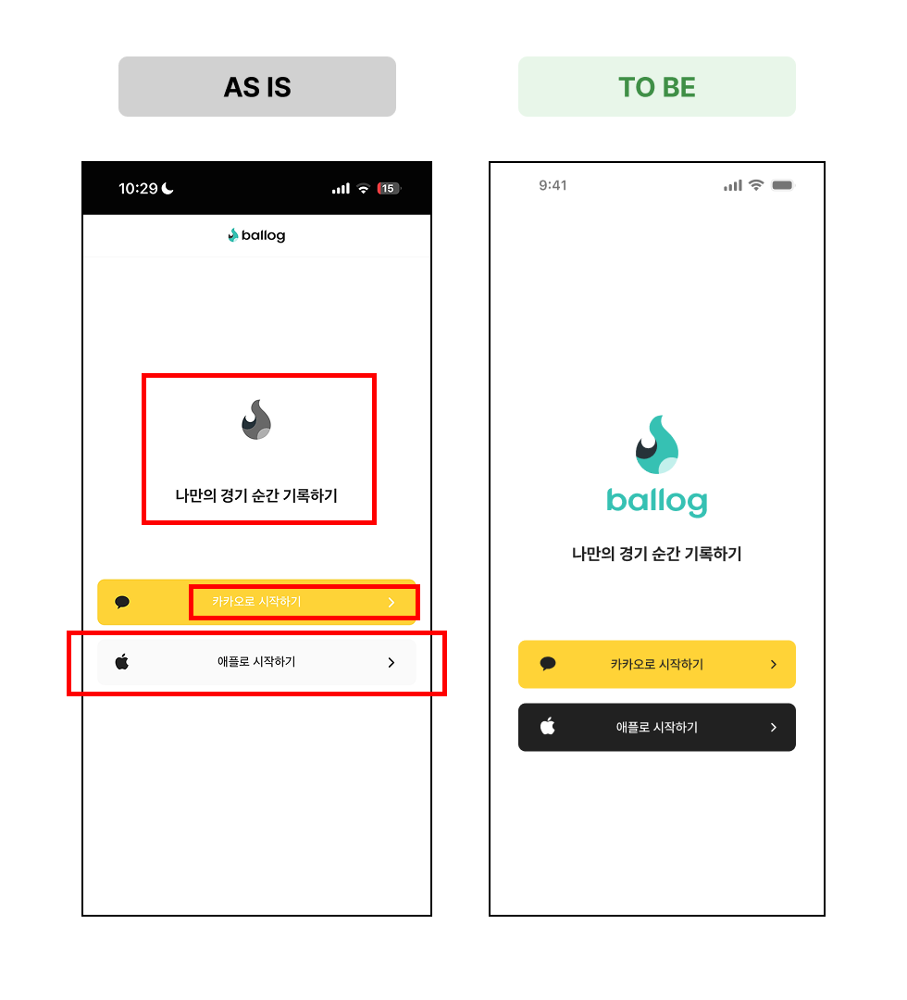

---

### F-03 · 이용약관 마크다운 렌더링

| | 내용 |
| --- | --- |
| **AS IS** | 마크다운 문법(`###`, `**`, `\|`)이 텍스트 그대로 노출됨 |
| **TO BE** | 마크다운 정상 렌더링 (불가 시 표라도 정상 렌더링, 표도 불가 시 회신 요청) |

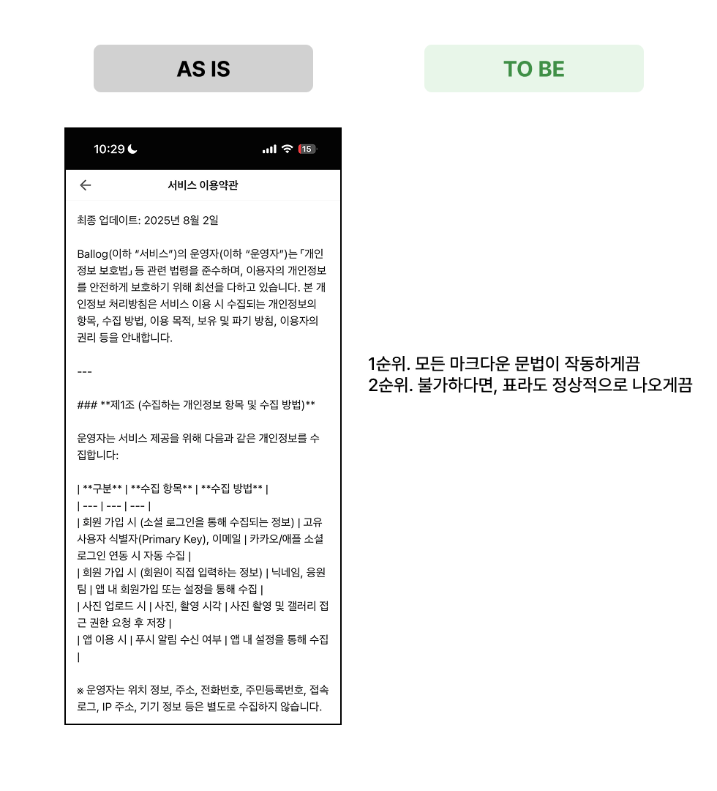

---

## ✅ 홈

### F-04 · 홈 메인 여백/사이즈 조정

| | 내용 |
| --- | --- |
| **AS IS** | 피그마 대비 여백 미반영, 캐릭터 상하 여백 없음 |
| **TO BE** | 피그마 스펙 기준 px 적용, 캐릭터 상단·하단 여백 추가 |

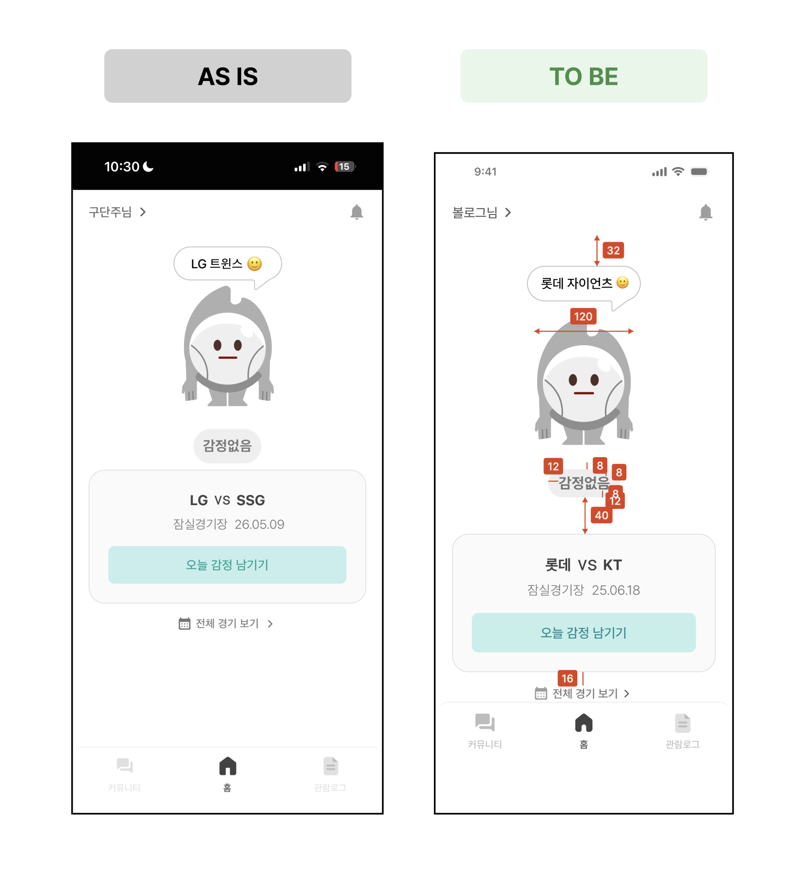

---

### F-05 · 실시간 기록 — 그래프 배경 + 감정 뱃지 색상

| 항목 | AS IS | TO BE |
| --- | --- | --- |
| 원형 그래프 | 회색 배경 없음 | 회색 배경 반영 |
| 감정 뱃지 색상 | 미반영 | 아래 스펙 참고 |

**감정 뱃지 색상 스펙**

| 감정 | 배경 | 텍스트 |
| --- | --- | --- |
| 기뻐요 | `#A4D4AA` | `#3F8F46` |
| 화나요 | `#F3B3B8` | `#E63946` |

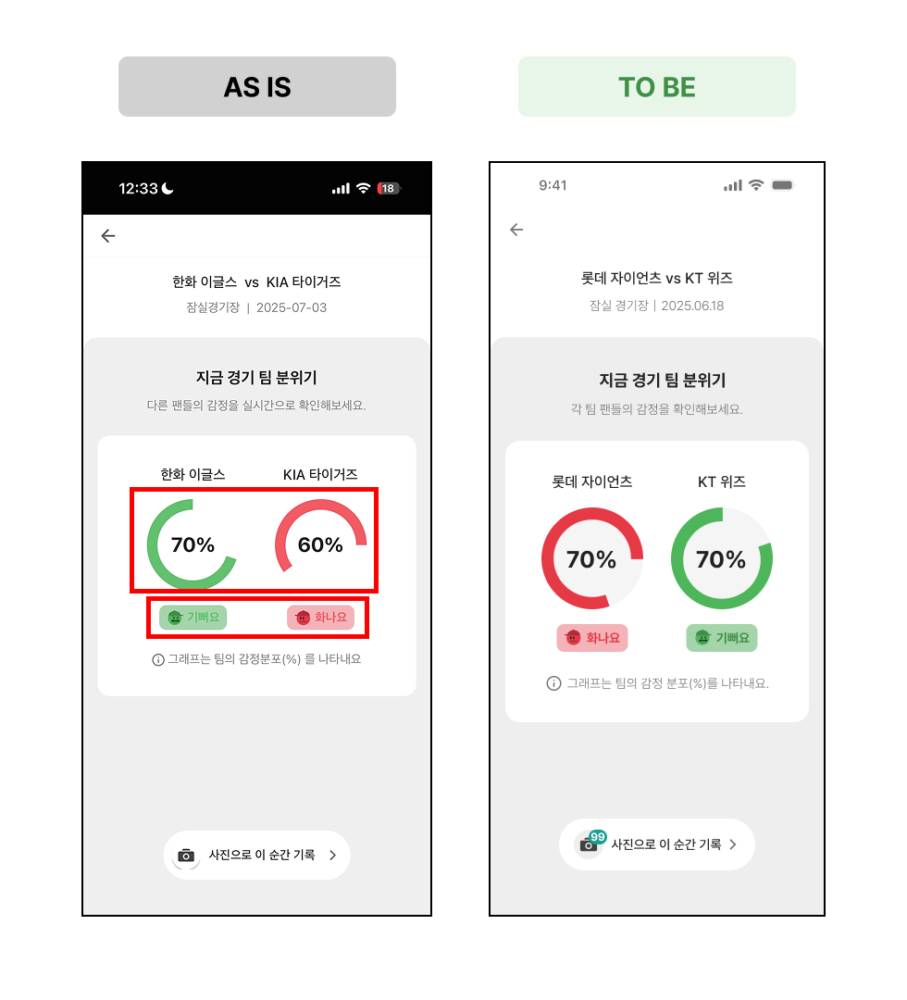

---

### F-06 · 실시간 기록 — 숫자 단위 · 표시 · 카메라 버튼 3건

| 항목 | AS IS | TO BE | 비고 |
| --- | --- | --- | --- |
| 숫자 단위 | `%` | `번` | - |
| 사진 업로드 후 숫자 | 미표시 | 업로드 개수 표시 | 데이터 미반영 이슈 가능성 있으므로 확인 필요 |
| 카메라 버튼 | 회색 배경 없음 | 회색 배경 반영 | - |

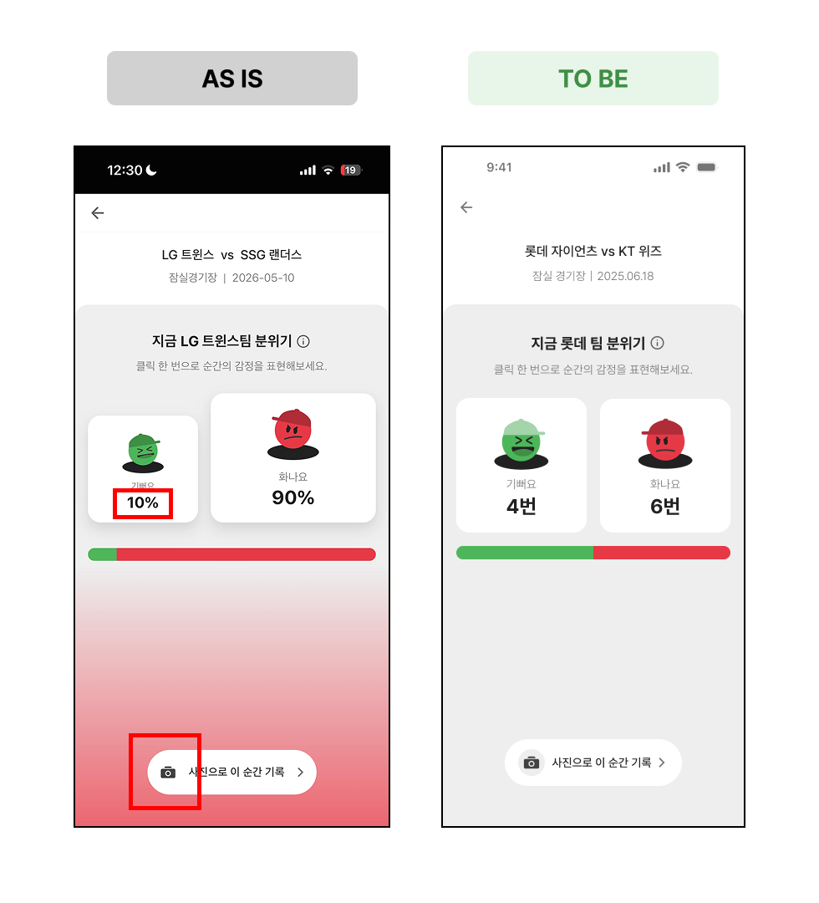

---

### F-07 · 경기 일정 — UI 5건

| 항목 | AS IS | TO BE |
| --- | --- | --- |
| 배경색 | 흰색 | `#EEEEEE` (날짜 선택바 하단 영역) |
| 날짜 정렬 | 오늘이 좌측에 위치 | 선택한 날짜(기본값: 오늘)가 탭 중앙에 위치 |
| 선택 날짜 표시 | 밑줄 없음 | 선택한 날짜 하단에 밑줄 표시 |
| 경기 시작 시간 | `HH:MM:SS` | `HH:MM` |
| 안내 문구 | "감정을 **공유**해보세요" | "감정을 **기록**해보세요" |

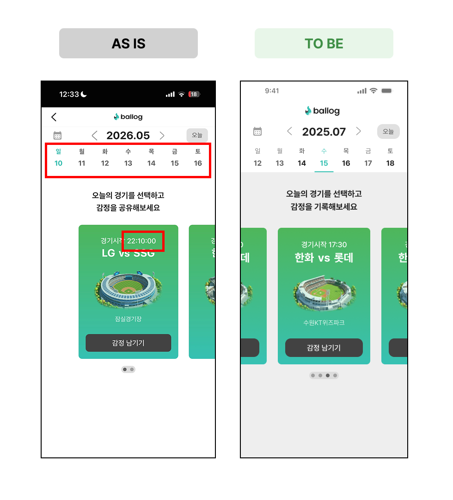

---

## ✅ 커뮤니티

### F-08 · KBO 순위 — 바텀시트 높이 + 감정 뱃지 색상

| 항목 | AS IS | TO BE |
| --- | --- | --- |
| 바텀시트 높이 | 9위까지만 표시 | 10위까지 한 번에 표시되도록 높이 조정 |
| 감정 뱃지 색상 | 미반영 | 아래 스펙 참고 |

**감정 뱃지 색상 스펙**

| 감정 | 배경 | 텍스트 |
| --- | --- | --- |
| 기뻐요 | `#CEF7D1` | `#3F8F46` |
| 화나요 | `#FFE5E6` | `#E63946` |
| 감정없음 | `#E0E0E0` | `#616161` |

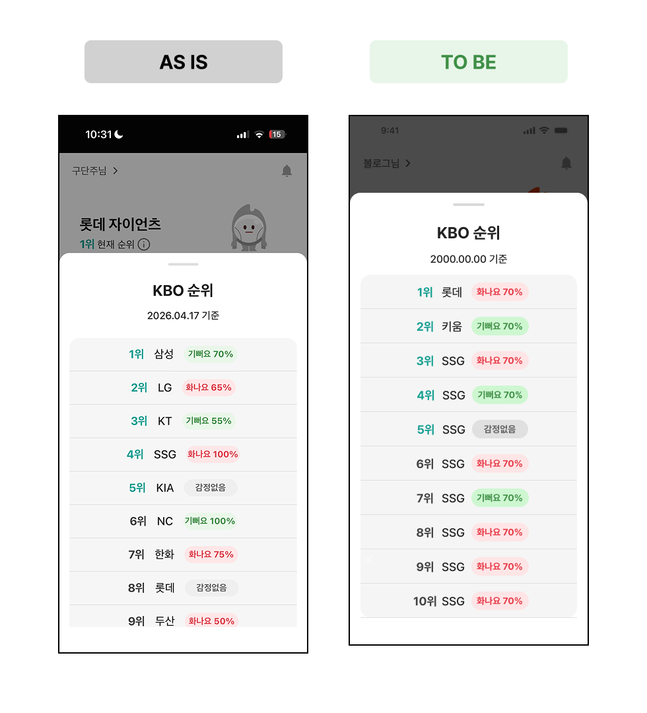

---

### F-09 · 친구 추가 — 키보드 미표시

| | 내용 |
| --- | --- |
| **AS IS** | '친구 추가' 클릭 시 바텀시트 내 텍스트 입력창만 표시 |
| **TO BE** | 바텀시트 표시와 동시에 키보드 자동 활성화 |

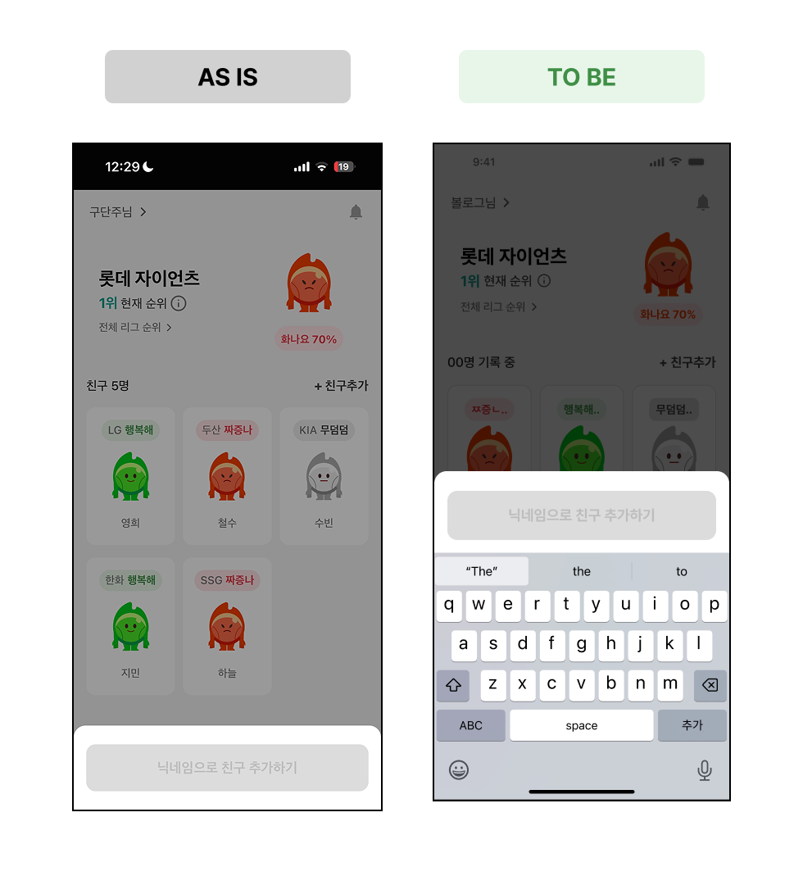

---

### F-10 · '친구 추가하기' 버튼 클릭 시 무반응

| | 내용 |
| --- | --- |
| **AS IS** | 친구 없는 상태에서 '친구 추가하기' 버튼 클릭 시 아무 동작 없음 |
| **TO BE** | F-09와 동일한 친구 추가 바텀시트 표시 |

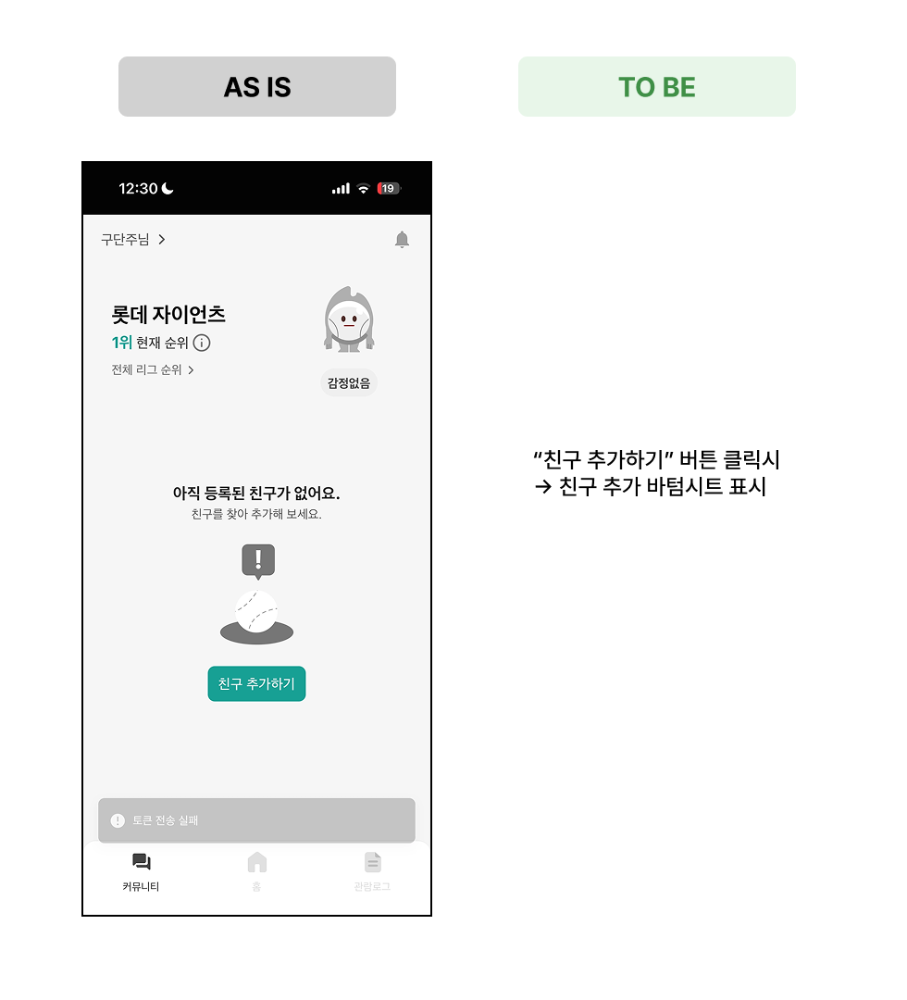

---

### F-11 · 친구 기록 페이지 접근 비활성화

| | 내용 |
| --- | --- |
| **AS IS** | 친구 목록에서 친구 클릭 시 친구 기록 페이지로 이동 |
| **TO BE** | 클릭 시 아무 동작 없음 (개발 완료 전까지 임시 비활성화) |

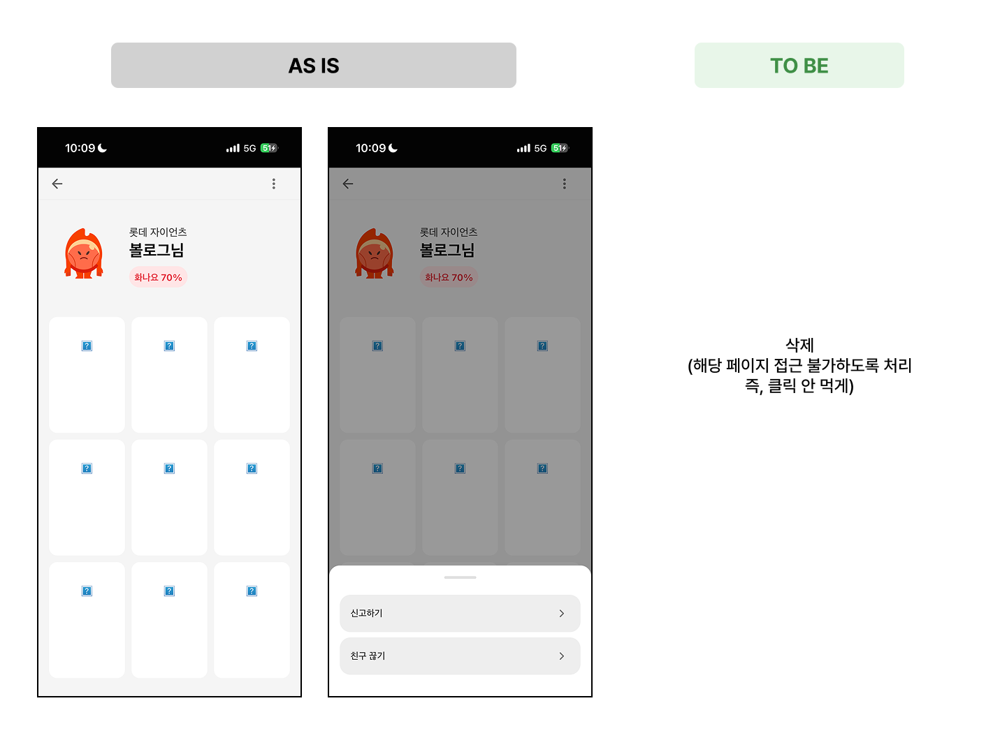

---

## ✅ 마이페이지

### F-12 · 마이페이지 — nav바 + 문의하기 2건

| 항목 | AS IS | TO BE |
| --- | --- | --- |
| 상단 nav바 좌측 | 버튼 없음 | 뒤로가기(`←`) 버튼 추가 |
| 기타 메뉴 | '문의하기' 항목 없음 | '문의하기' 추가 → 클릭 시 볼로그 구글 계정 이메일 작성 페이지로 외부 이동 |

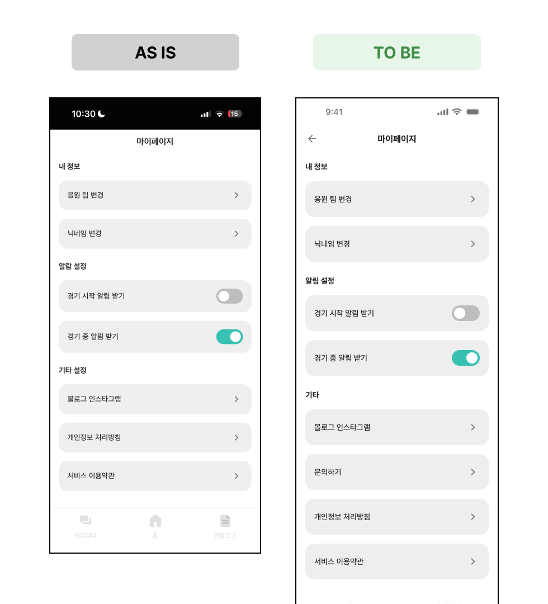

---

# E.O.D